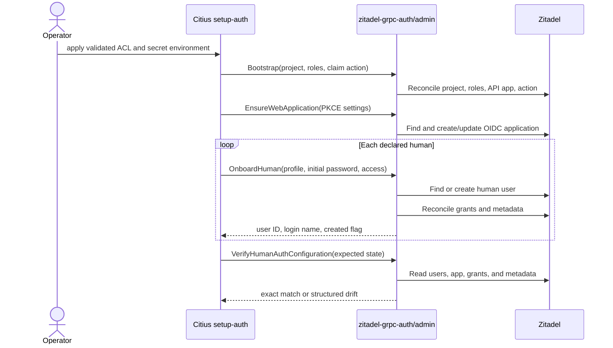
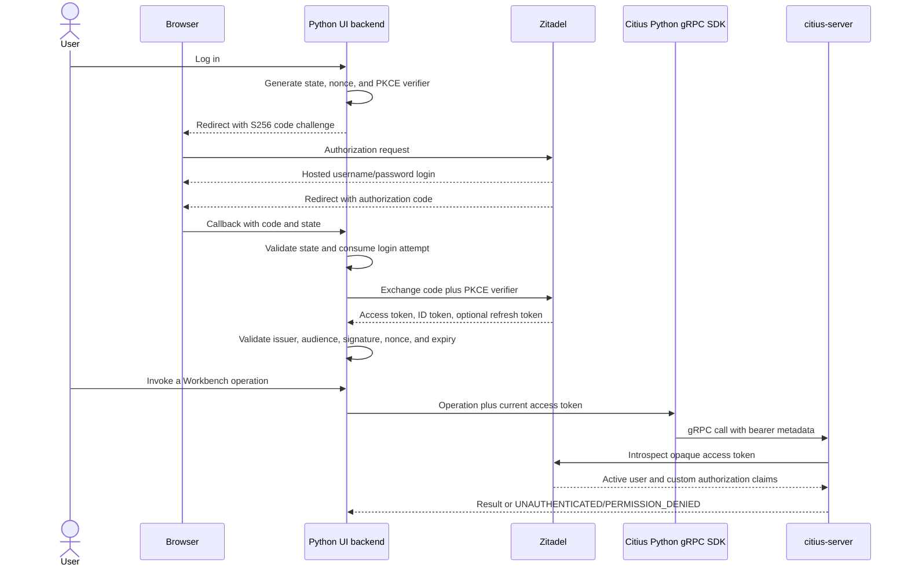

# Human Login Implementation Plan

This document tracks the incremental `zitadel-grpc-auth` work required to add
human identities and provision the OpenID Connect application used by the Citius
API Workbench. Each numbered item is intended to be one atomic commit with the
one-line message shown below.

The implementation is deliberately split from the later Citius ACL, Python SDK,
and UI work. Completing this plan makes Zitadel ready for those consumers; it
does not itself build the browser UI.

## Progress

| State | Item | Commit | Outcome |
|---|---:|---|---|
| Done | ZGA-01 | `6827c53 Add human onboarding input validation` | Defines and validates a human onboarding contract without mixing passwords with machine-user secrets. |
| Done | ZGA-02 | `9c36400 Add human user onboarding` | Creates or reuses a human, rejects a machine-user collision, and reconciles grants and metadata. |
| Done | ZGA-03 | `06f8c3f Add explicit human password reset` | Adds an operator-only password reset that never resets a password implicitly. |
| Done | ZGA-04 | `a12e4b4 Add admin API test seam` | Makes Zitadel admin calls replaceable in unit tests without changing public behavior. |
| Done | ZGA-05 | `5dad47e Harden Zitadel resource lookups` | Replaces first-page scans with exact, pagination-safe user and application lookups. |
| Done | ZGA-06 | `61c627d Validate PKCE web application input` | Defines the Web/OIDC input and enforces strict redirect URI and security-profile rules. |
| Done | ZGA-07 | `d6291e0 Reconcile PKCE web applications` | Creates, reuses, or updates the exact OIDC application configuration and rejects type collisions. |
| Done | ZGA-08 | `1e806e6 Add human auth configuration verification` | Reports drift in human type/state, grants, metadata, and OIDC application configuration. |
| Done | ZGA-09 | `Test human provisioning with Zitadel` | Proves create, repeat, drift repair, collision, and password reset behavior against live Zitadel. |
| Planned | ZGA-10 | `Document human authentication APIs` | Adds public package examples and the supported PKCE integration contract to the README. |

Current count: **9 of 10 commits complete; 1 remains**. Commit count is not an
effort percentage: OIDC reconciliation and verification are larger than the
completed validation commits.

When a planned item is implemented, its row should be marked `Done` in the same
commit. The resulting hash can be added by the following increment; Git history
and the unique one-line message remain the authoritative record.

## Target outcome

At the end of ZGA-10, a caller can use the `admin` package to:

1. create or reuse a human user with profile, email, initial password, project
   roles, and Citius resource metadata;
2. distinguish a newly created user from an existing user without changing the
   existing user's password;
3. reset a selected human user's password only through an explicit operation;
4. create or reconcile a Web/OIDC application configured for Authorization Code
   with PKCE;
5. inspect the resulting resources and report configuration drift; and
6. verify the provisioning behavior against a real Zitadel instance.

Existing machine-user bootstrap, client-credentials authentication, token claim
customization, and gRPC authorization must remain backward compatible.

## Responsibility boundary

`zitadel-grpc-auth` owns reusable Zitadel administration and Go gRPC bearer-token
enforcement. It does not render a login form or receive a human password during
normal application login.

| Component | Responsibility |
|---|---|
| `zitadel-grpc-auth/admin` | Project roles, human users, initial/reset passwords, grants, metadata, OIDC application, and configuration verification |
| Zitadel hosted login | Username/password interaction, authentication policy, session, authorization code, tokens, and logout |
| Citius Python UI | Browser redirects, PKCE state/verifier, callback, server-side token/session storage, refresh, and logout coordination |
| Citius Python SDK | Attach the current access token as gRPC `authorization: Bearer ...` metadata |
| `zitadel-grpc-auth/server` | Extract bearer token, introspect it, validate issuer/audience, and enforce method policy |
| `citius-server` | Map RPCs to permissions and apply key/policy resource authorization |

A future Go web application could add a separate runtime OIDC helper package,
but that is not required by the Python Workbench and is not part of this plan.

## Provisioning flow



Initial passwords exist only in memory for the create/reset call. They must not
appear in logs, result types, generated non-secret configuration, or verification
output.

## Runtime login and API flow



The UI never implements a resource-owner password grant. Zitadel does not
support that grant, and the password belongs only on the hosted login page.

## Increment details

### ZGA-01 — Human onboarding input validation — Done

Commit: `6827c53 Add human onboarding input validation`

Added `HumanOnboardInput` separately from machine `OnboardInput`. Validation
requires username, given name, family name, email, and initial password, then
reuses the existing permission and key/policy pattern validation.

Acceptance achieved:

- valid human input passes;
- missing identity fields fail before any network call;
- invalid email, permission, and resource patterns fail;
- a human password cannot be supplied through the machine-user input type; and
- all repository tests and `go vet` pass.

### ZGA-02 — Human user onboarding — Done

Commit: `9c36400 Add human user onboarding`

Added public `OnboardHuman`, request construction for Zitadel's human-user
oneof, create-versus-existing reporting, human type checking, login-name
selection, and reuse of authorization/metadata reconciliation.

Important behavior:

- the initial password is sent only when `CreateUser` is called;
- rerunning onboarding for an existing human does not change the password;
- a matching machine or unknown user type returns `ErrUserTypeMismatch`; and
- no password is logged or returned.

### ZGA-03 — Explicit human password reset — Done

Commit: `06f8c3f Add explicit human password reset`

Added public `ResetHumanPassword`. It resolves the selected human, calls
Zitadel's `SetPassword`, supports the change-required flag, and returns
`ErrUserNotFound` or `ErrUserTypeMismatch` where appropriate.

The reset does not modify grants, metadata, profile, email, or applications.

### ZGA-04 — Admin API test seam — Done

Commit message: `Add admin API test seam`

Introduce narrow internal interfaces or operation wrappers for the Zitadel
services used by `admin`. `NewClient` will continue constructing the real SDK
client, while tests can supply recordable fakes.

Acceptance:

- no exported API or runtime behavior changes;
- existing bootstrap/onboard/revoke tests remain green;
- a fake can record `ListUsers`, `CreateUser`, `GetUserByID`, `SetPassword`,
  authorization, metadata, and application calls; and
- subsequent orchestration tests require no live network service.

### ZGA-05 — Reliable Zitadel resource lookup — Done

Commit message: `Harden Zitadel resource lookups`

Replace the current first-page scans with exact server-side queries where the
pinned SDK supports them, plus pagination where required. Centralize user and
application lookup so machine onboarding, human onboarding, reset, revoke, and
OIDC reconciliation share the same semantics.

Acceptance:

- a target beyond the first result page is found;
- exact username and project/name matching is enforced;
- zero matches and wrong-type matches remain distinct;
- duplicate exact matches fail rather than choosing arbitrarily; and
- machine-user behavior remains unchanged apart from fixing missed lookups.

### ZGA-06 — PKCE Web/OIDC input and validation — Done

Commit message: `Validate PKCE web application input`

Add a public `WebApplicationInput` and result contract. The initial supported
profile is intentionally narrow:

- OIDC Web application;
- Authorization Code response and grant;
- PKCE token-endpoint authentication (`none` in the Zitadel model);
- OIDC 1.0;
- opaque bearer access tokens for existing server introspection;
- optional refresh-token grant controlled explicitly by input; and
- exact redirect and post-logout URI sets.

URI validation must require absolute URIs, reject fragments, user information,
wildcards, duplicates after normalization, and non-HTTPS schemes. Development
mode may permit HTTP only for loopback hosts such as `localhost`, `127.0.0.1`,
and `::1`; it must not turn arbitrary HTTP or wildcard redirects into valid
production input.

Acceptance includes table-driven negative tests for every rejected URI class
and pure request-shape tests for the fixed security profile.

### ZGA-07 — Web/OIDC application reconciliation — Done

Commit message: `Reconcile PKCE web applications`

Add public `EnsureWebApplication`. Resolve the configured project, find an exact
application match, create it when absent, update mutable OIDC settings when they
drift, and reject a same-name API/SAML application.

The reconciler owns the complete declared URI sets: removed URIs are removed
from Zitadel. It returns the application ID and client ID plus `Created` and
`Updated` flags. The default PKCE profile has no client secret; adding a
confidential Basic/private-key profile would be a separate explicit extension.

Acceptance:

- absent application produces one create call;
- identical application produces no write call;
- drift produces one exact update call;
- wrong application type returns a typed mismatch error;
- reordered equivalent URI input is idempotent; and
- no credential can appear in logs or non-secret results.

### ZGA-08 — Read-only configuration verification — Planned

Commit message: `Add human auth configuration verification`

Add a verification API that reads, but never repairs, the declared humans and
Web/OIDC application. It should return structured drift suitable for a CLI while
keeping secrets out of both expected and actual snapshots.

Verify:

- user exists, is human, and is in an acceptable active/initial state;
- expected profile and email fields;
- exact project roles;
- exact key and policy access metadata;
- exact OIDC type, authentication method, grants, response types, token type,
  development mode, and redirect URI sets; and
- required claim-action/project settings that affect human access tokens.

Passwords are intentionally unverifiable and must never be included.

### ZGA-09 — Live Zitadel integration coverage — Planned

Commit message: `Test human provisioning with Zitadel`

Add environment-gated tests using the repository's Zitadel development setup.
They must be safe to rerun and clean up only resources uniquely owned by the
test.

Scenarios:

- first onboarding creates a human and reports `Created`;
- second onboarding reuses the user and does not reset its password;
- grant and metadata drift is repaired exactly;
- machine/human and application-type collisions fail;
- explicit password reset changes only the target human;
- Web/OIDC creation is idempotent and drift is reconciled; and
- verification reports clean state, then detects an induced drift.

An actual browser login is a downstream end-to-end acceptance test because
Zitadel intentionally has no resource-owner password grant.

### ZGA-10 — Public documentation and handoff — Planned

Commit message: `Document human authentication APIs`

Update package documentation and the README with concise examples for human
onboarding, explicit reset, Web/OIDC provisioning, and verification. Document
the hosted-login boundary and the non-secret values the Python UI needs:

- issuer/discovery URL;
- OIDC client ID;
- exact redirect and post-logout URI;
- scopes, including API audience and optional `offline_access`; and
- Citius gRPC target.

Do not copy local passwords, PATs, client secrets, or tokens into examples.
Tagging or publishing a release is outside this commit and requires an explicit
request.

## Verification required for every commit

This repository currently has no checked-in Makefile, so each increment uses:

```text
gofmt on changed Go files
go test ./admin/... -count=1
go test ./... -count=1
go vet ./...
git diff --check
```

Tests that open local listeners require an environment where loopback sockets
are permitted. Before committing, review the complete staged diff and stage only
the files belonging to that increment.

## Work after this repository

The following work is deliberately not counted in the ten ZGA commits:

1. extend the Citius ACL schema for typed human users and a Web/OIDC app;
2. declare and provision CISO, Producer, and Consumer demo identities;
3. add `setup-auth` validation/apply/verify/reset commands and secret sourcing;
4. implement the Python gRPC SDK and its bearer-token interceptor;
5. implement the Python UI's OIDC discovery, PKCE callback, session, refresh,
   and logout handling;
6. replace mock Workbench calls with the Python SDK; and
7. run the three-user permission and resource-authorization acceptance matrix.

These downstream steps consume the public contracts delivered here rather than
duplicating Zitadel provisioning logic.

## References

- [Zitadel application types](https://zitadel.com/docs/guides/manage/console/applications-overview)
- [Zitadel Authorization Code and PKCE](https://zitadel.com/docs/guides/integrate/login/oidc/login-users)
- [Zitadel recommended OAuth flows](https://zitadel.com/docs/guides/integrate/login/oidc/oauth-recommended-flows)
- [Zitadel OIDC endpoints](https://zitadel.com/docs/apis/openidoauth/endpoints)
- RFC 7636, Proof Key for Code Exchange
- RFC 9700, OAuth 2.0 Security Best Current Practice
- OpenID Connect Core 1.0 and Discovery 1.0

For deployed endpoint paths and request fields, runtime discovery metadata and
the repository's pinned `zitadel-go` version are authoritative.
